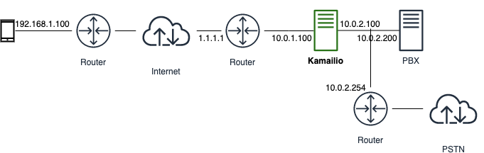

# Kamailio Playground

## Kamailio en Modo Bridge

En este escenario, se configura el kamailio en un servidor con dos interfaces de red. Una que mira hacia una DMZ (10.0.1.0/24), y otra que mira hacia la red interna (10.0.2.0/24). La interfaz del Kamailio esta públicada en Internet con la IP 1.1.1.1. 

